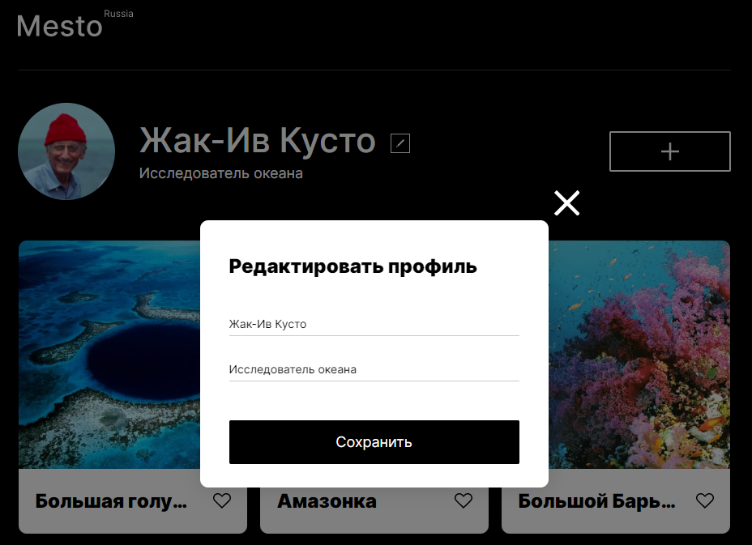

# 

## Описание проектной работы
В ходе выполнения проектной работы #4 был реализован Popup с возможностью редактирования и сохранения информации.

## Посмотреть работу
[Клац](https://spacestrix.github.io/mesto/)

## Используемые языки и технологии

    &nbsp;
    &nbsp;
    &nbsp;
    &nbsp;
    &nbsp;

## Screenshots

